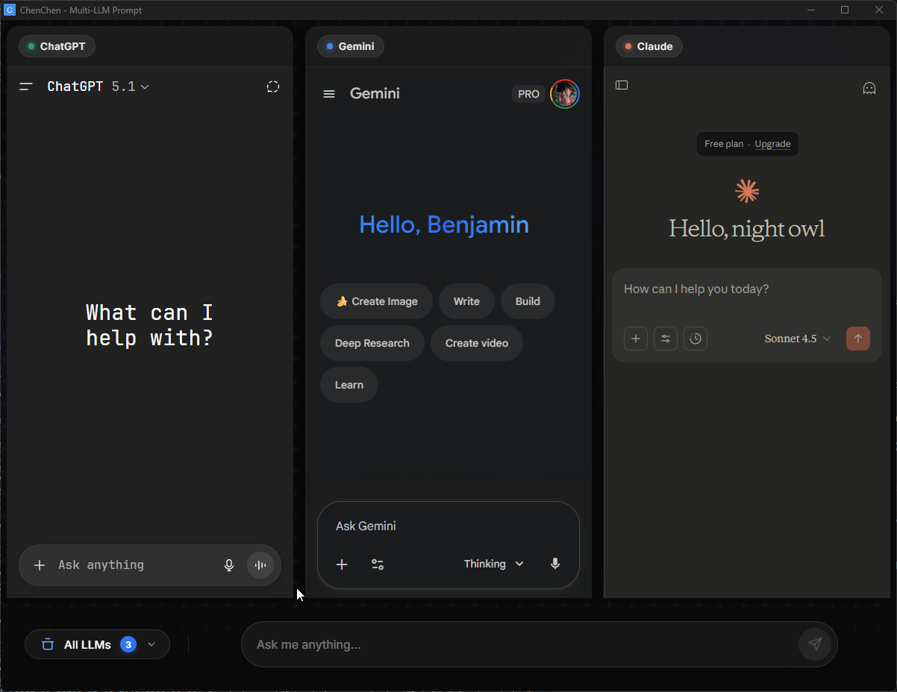

# ChenChen - Multi-LLM Prompt Desktop App

**Send prompts to multiple LLM providers simultaneously** - A privacy-focused desktop application built with Tauri and Rust.

## Demo



## Features

- 🤖 **Multi-Provider Support**: Send prompts to ChatGPT, Gemini, and Claude simultaneously
- 🔒 **Privacy-First**: No credential storage, no telemetry, all data stays local
- 💾 **Persistent Sessions**: Provider webviews with persistent authentication sessions
- 📊 **Real-Time Status**: Track submission progress with retry logic and timeout handling
- 🔐 **Authentication Detection**: Automatic detection of login requirements
- 🛡️ **Anti-Detection**: Built-in Cloudflare bypass for uninterrupted access
- 🔄 **Webview Control**: Refresh individual provider sessions
- 🎨 **Split-Screen Layout**: Responsive grid layout for viewing multiple providers
- ⚡ **Fast & Lightweight**: Built with Rust and Tauri 2.0

## Quick Start

### Prerequisites

- **Rust** (latest stable) - [Install Rust](https://rustup.rs/)
- **Node.js** (v18+) - [Install Node.js](https://nodejs.org/)
- **npm** or **pnpm**

### Installation

```bash
# Clone the repository
git clone https://github.com/your-org/chenchen.git
cd chenchen

# Install frontend dependencies
npm install

# Install Tauri CLI
cargo install tauri-cli

# Run in development mode
npm run tauri dev
```

### Build for Production

```bash
# Build optimized binary
npm run tauri build

# Binary will be in src-tauri/target/release/
```

## Usage

1. **Launch ChenChen**
   - The app opens with all three providers (ChatGPT, Gemini, Claude) available

2. **Select Providers**
   - Check the providers you want to send prompts to (1-3 providers)
   - Login indicators show which providers need authentication

3. **Authenticate**
   - Click "Login Required" buttons to authenticate with providers
   - Sessions are persisted across app restarts

4. **Send Prompts**
   - Enter your prompt in the text area
   - Click "Send Prompt" or press Enter
   - View real-time submission status for each provider

## Development

### Project Structure

```
chenchen/
├── src/                    # Svelte frontend
│   ├── components/         # UI components
│   ├── routes/             # Svelte routes
│   ├── services/           # TypeScript services
│   ├── app.css             # Global styles
│   ├── app.html            # App entry point
│   └── types.ts            # TypeScript types
├── src-tauri/              # Rust backend
│   ├── src/
│   │   ├── injection/      # JavaScript injection
│   │   ├── layout/         # Layout calculation
│   │   ├── providers/      # Provider management
│   │   ├── status/         # Submission tracking
│   │   ├── commands.rs     # Tauri commands (IPC)
│   │   ├── lib.rs          # Library entry point
│   │   ├── logging.rs      # Structured logging
│   │   ├── main.rs         # Binary entry point
│   │   ├── state.rs        # App state management
│   │   └── types.rs        # Shared types
│   └── tests/              # Rust tests
└── docs/                   # Documentation
    ├── privacy-policy.md
    ├── testing-guide.md
    └── linux-webview-positioning-fix.md
```

### Running Tests

```bash
# Backend tests (Rust)
cd src-tauri
cargo test

# Frontend tests (TypeScript/Svelte)
npm test

# All tests
npm run test:all
```

### Code Quality

```bash
# Rust linting
cargo clippy

# Rust formatting
cargo fmt

# TypeScript checking
npm run check
```

## Architecture

### Backend (Rust + Tauri 2.0)

- **Commands**: Tauri IPC interface for frontend communication
- **Provider Manager**: Manages provider selection state (1-3 providers)
- **Layout Calculator**: Computes split-screen dimensions based on selected providers
- **Webview Manager**: Platform-specific session persistence
- **Injector**: JavaScript injection for prompt submission
- **Status Tracker**: Submission state machine with retry logic
- **Structured Logging**: Dual-format (JSON + human-readable) logging

### Frontend (Svelte 5 + TypeScript)

- **ProviderSelector**: Provider selection and authentication UI
- **PromptInput**: Prompt text area with validation
- **StatusDisplay**: Real-time submission status tracking
- **Provider Panels**: Split-screen webview containers

### Data Flow

```
User Input → PromptInput → submit_prompt command
                                    ↓
                          StatusTracker creates submissions
                                    ↓
                          Injector generates scripts
                                    ↓
                          Execute in provider webviews
                                    ↓
                          Status updates → StatusDisplay
```

## Privacy Guarantees

**ChenChen is committed to user privacy:**

- ✅ **No credential storage** - Passwords never leave webview sandboxes
- ✅ **No prompt history** - All data in-memory only
- ✅ **No telemetry** - Zero analytics or tracking
- ✅ **Local-only operation** - No backend servers
- ✅ **Provider domains only** - Network requests limited to LLM providers

See [docs/privacy-policy.md](docs/privacy-policy.md) for full details.

### Verify Privacy

```bash
# Run privacy tests
cd src-tauri
cargo test privacy_test

# Manual network monitoring (see docs/testing-guide.md)
```

## Testing

### Test Coverage

- **Unit Tests**: 26 tests (providers, layout, injection, status, logging)
- **Contract Tests**: 19 tests (public API interfaces)
- **Integration Tests**: 24 tests (privacy, success rate, logging formats)
- **Total**: 69 automated tests

### Success Criteria

- ✅ **>=95% success rate** for prompt submissions (SC-002)
- ✅ **<10 second** submission time to 3 LLMs (SC-001)
- ✅ **Zero data collection** verified by privacy tests

## Configuration

### Provider Configuration

Edit `src-tauri/config/providers.json`:

```json
{
  "config_version": "1.0.0",
  "providers": {
    "ChatGPT": {
      "url": "https://chat.openai.com/",
      "input_selectors": ["textarea", "#prompt-textarea"],
      "submit_selectors": ["button[data-testid='send-button']"],
      "auth_check_selectors": ["button[data-testid='login-button']"]
    }
  }
}
```

## Troubleshooting

### "Failed to load providers"
- Ensure `src-tauri/config/providers.json` exists
- Check JSON syntax validity

### "Login Required" persists after login
- Clear webview data: delete `~/.local/share/com.chenchen.app/webviews/`
- Restart the application

### Slow prompt submission
- Check network connection
- Verify provider websites are accessible
- Review timeout settings (30s default)

### Linux: Webviews stacking vertically instead of positioning correctly
This is a known GTK issue that affects all Tauri multiwebview applications on Linux. The project includes patches to fix this:

**Symptoms:**
- Multiple webviews stack vertically
- `set_webview_position()` and `set_webview_size()` are ignored
- Works fine on Windows/macOS but fails on Linux

**Solution:**
The patches are already applied in `Cargo.toml`. If you cloned the repository, they should work automatically. To verify:

```bash
# Check that patches are applied
cargo tree -p tao --depth 0
cargo tree -p tauri-runtime-wry --depth 0

# Should show GitHub URLs from Benjaminlooi forks
```

**For more details**, see [docs/linux-webview-positioning-fix.md](docs/linux-webview-positioning-fix.md)

**Related Issues:**
- https://github.com/tauri-apps/tauri/issues/10420
- https://github.com/tauri-apps/tauri/issues/13071

## Contributing

Contributions are welcome! Please:

1. Fork the repository
2. Create a feature branch (`git checkout -b feature/amazing-feature`)
3. Follow TDD: write tests first
4. Ensure all tests pass (`cargo test && npm test`)
5. Run linters (`cargo clippy && npm run check`)
6. Commit with descriptive messages
7. Push and create a Pull Request

### Development Principles

- **TDD First**: Write tests before implementation
- **Privacy by Design**: No data collection ever
- **Dual Logging**: JSON + human-readable formats
- **Type Safety**: Rust + TypeScript with strict typing

## License

[MIT License](LICENSE)

## Acknowledgments

- Built with [Tauri 2.0](https://tauri.app/)
- Frontend powered by [Svelte 5](https://svelte.dev/)
- LLM providers: OpenAI, Google, Anthropic

---

**Version**: 0.2.0
**Status**: MVP Complete
**Platform**: Windows, macOS, Linux (with positioning patches)
